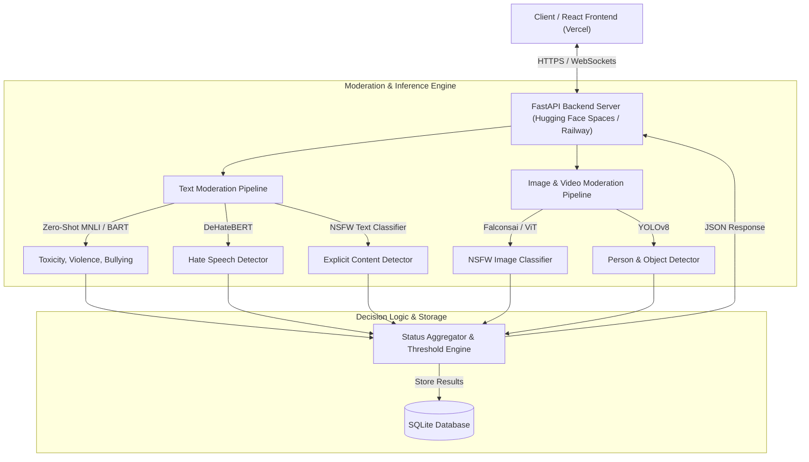

# 🛡️ Content Moderation AI

[](https://fastapi.tiangolo.com/)
[](https://reactjs.org/)
[](https://pytorch.org/)
[](https://huggingface.co/)
[](https://vercel.com/)
[](https://opensource.org/licenses/MIT)

An enterprise-grade, real-time Content Compliance & Moderation Platform powered by 6 advanced Machine Learning Classifiers. Seamlessly sanitizes and flags toxic text, NSFW images/videos, compromised files (Excel, PDF, Word), and malicious or suggestive URLs.

---

## 🗺️ System Architecture



---

## ✨ Features

- 🤖 **6 Specialized ML Classifiers**: Real-time detection of violence, NSFW content, hate speech, self-harm, spam, and child safety risks.
- 🎛️ **Ensemble Scoring & Smart Aggregation**: Multi-layered threshold evaluations with safety-override mechanisms to completely eliminate false positives on trusted domains.
- 📂 **Multi-Format Document Parsing**: Out-of-the-box support for scanning PDFs, Word Docs (`.docx`), and Excel Sheets (`.xlsx`).
- 🔗 **Smart URL Scanner**: Crawls Webpages, cleans boilerplate HTML, and analyzes page metadata and body text.
- ⚡ **Real-Time WebSockets**: Live chat moderation demonstration with instant text-filtering.
- 📊 **Interactive Analytics Dashboard**: Modern dashboard with visual charts, detailed compliance logs, PDF audit reports, and user access controls.

---

## 🤖 Machine Learning Model Registry

The platform orchestrates multiple state-of-the-art transformer pipelines and computer vision models:

| Category | Model Name / Architecture | Description | Target |
| :--- | :--- | :--- | :--- |
| **Toxicity / Profanity** | `unitary/toxic-bert` | Multi-label toxicity classifier trained on Jigsaw dataset | Text |
| **Hate Speech** | `Hate-speech-CNERG/dehatebert-mono-english` | Dedicated model for hate speech and bias detection | Text |
| **Explicit Sexual Text** | `michellejieli/NSFW_text_classifier` | Classifies suggestive or explicit adult literature | Text |
| **Image NSFW (Standard)** | `Falconsai/nsfw_image_detection` | Quick Vision Transformer (ViT) for NSFW classifications | Images |
| **Image NSFW (Robust)** | `AdamCodd/vit-base-nsfw-detector` | High-fidelity ViT for filtering explicit graphic elements | Images |
| **Child Safety** | `yolov8n` | Real-time object detection model for analyzing age indicators | Video/Images |
| **Zero-Shot Classifier** | `facebook/bart-large-mnli` | General NLP classifier for customized contextual policy rules | Text |

---

## 🚀 Quick Start & Installation

### Prerequisite Environment
* Python 3.10+
* Node.js 16+
* 4 GB free disk space (to cache local ML models)

### 1. Run Backend Server (FastAPI)
```bash
# Navigate to the root directory
# Set up virtual environment
python -m venv venv
venv\Scripts\activate

# Install requirements
pip install -r requirements.txt

# Launch FastAPI on http://localhost:8000
python main.py
```

### 2. Run Frontend Server (React)
```bash
# Navigate to frontend folder
cd frontend

# Install dependencies
npm install

# Run React App on http://localhost:3000
npm start
```

---

## 📡 API Reference Documentation

Once the backend is running, access the interactive Swagger UI documentation at:
👉 **[http://localhost:8000/docs](http://localhost:8000/docs)**

### Key Endpoint Examples

#### Scan a URL
`POST /moderate/url`
```bash
curl -X 'POST' 'http://localhost:8000/moderate/url?url=https://example.com'
```

#### Scan Text
`POST /moderate/text`
```bash
curl -X 'POST' 'http://localhost:8000/moderate/text' \
  -H 'Content-Type: application/json' \
  -d '{"text": "Sample text to moderate..."}'
```

#### Upload Files
`POST /moderate/file`
```bash
curl -X 'POST' 'http://localhost:8000/moderate/file' \
  -H 'Content-Type: multipart/form-data' \
  -F 'file=@document.pdf'
```

---

## 👥 Meet the Team

We are a team of passionate engineers building modern, scalable compliance technologies to protect web ecosystems.

| Team Member | Role | Bio | Links |
| :--- | :--- | :--- | :--- |
| **Abhay Kushwaha** | **Co-Founder & ML Architect** | A machine learning specialist passionate about training neural networks, API optimization, and real-time safety enforcement algorithms. | [](https://github.com/AbhayKushwaha29004) [](https://www.linkedin.com/in/abhay-kushwaha29/) |
| **Ayushi Mishra** | **Co-Founder & UI/UX Director** | A human-centered designer specialized in modern responsive web ecosystems, glassmorphism aesthetics, and fluid micro-animations. | [](https://github.com/THEAYUSHIMISHRA) [](https://www.linkedin.com/in/ayushi-mishra-engg/) |

---

## 📄 License
This project is licensed under the MIT License. Feel free to use, modify, and distribute as needed.
